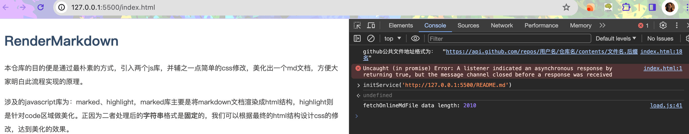
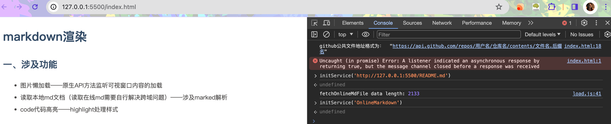

# RenderMarkdown
本仓库的目的便是通过最朴素的方式，引入两个js库，并辅之一点简单的css修改，美化出一个md文档，方便大家明白此流程实现的原理。

涉及的javascript库为：marked、highlight，marked库主要是将markdown文档渲染成html结构，highlight则是针对code区域做美化。正因为二者处理后的**字符串**格式是**固定**的，我们可以根据最终的html结构设计css的修改，达到美化的效果。

## 一、涉及功能

- 图片懒加载——原生API方法监听可视窗口内容的加载
- 读取本地md文档（读取在线md需要自行解决跨域问题）——涉及marked解析
- code代码高亮——highlight处理样式

## 二、在线md加载调试

该项目默认加载本地/public/md/OnlineMarkdown.md文件，不过项目之中也设置了初始化服务initService,只需要打开控制台调用该函数即可。

### 2.1 initService结构

```javascript
/**
 * 初始化服务
 * @param {string} filenameOrUrl
 */
function initService(filenameOrUrl) {
  // 设置marked
  marked.setOptions({...});
  // 判断当前入参是否是一个在线文件                   
  let isOnline = filenameOrUrl.includes("http") ? true : false;
  if (isOnline) {
    // github获取的资源为json格式，故该函数对github单独做了处理，请注意跨域的问题
    fillMarkdownContentByOnlineFile(filenameOrUrl);
  } else {
    // 只走项目中“/public/md/文件名”该路径的文件，此时filenameOrUrl传文件名即可
    // 不在上述path下的同仓库文件，应该走云端链接实现
    fillMarkdownContent(filenameOrUrl);
  }
}
```

### 2.2 控制台调试

#### 2.2.1 在线地址



#### 2.2.2 本地地址



## 三、优化加载速度

### 3.1 图片懒加载

图片懒加载是通过IntersectionObserver方法实现的，本质原理便是判断当前元素是否在可视化窗口内，从而触发加载操作。

```javascript
/**
 * 处理md字符串
 * @param {string} mdStr
 * @description 将md字符串中的img标签的src属性替换为data-src属性，src属性设置为空字符串
 */
function solveMdStr(mdStr) {
  // 使用正则表达式匹配  标签的内容和 src 属性
  const regex = /]+src="([^"]+)"[^>]*>/g;
  mdStr = mdStr.replace(regex, (match, src) => {
    return match.replace(
      `src="${src}"`,
      `data-has-lazy-src=false data-src="${src}" src=""`
    );
  });
  return mdStr;
}
```

```javascript
/**
 * 初始化图片懒加载
 * @description IntersectionObserver是浏览器内置的一个API，用于监听元素是否进入视口
 */
function initObesrver() {
  let imgs = document.querySelectorAll("img");
  const observer = new IntersectionObserver(
    (entries) => {
      entries.forEach((entry) => {
        // 元素进入视口
        if (entry.isIntersecting) {
          // 是否含有data-has-lazy-src属性，只有该属性值为true时不再做操作，防止二次操作
          let hasLaySrc = entry.target.getAttribute("data-has-lazy-src");
          if (hasLaySrc === "false") {
            // 对img的src赋值，并删除data-src中的值，减少dom元素大小
            entry.target.src = entry.target.getAttribute("data-src");
            entry.target.removeAttribute("data-src");
            entry.target.setAttribute("data-has-lazy-src", true);
          }
        }
      });
    },
    { threshold: 1 }
  );
  if (imgs.length > 0) {
    imgs.forEach((img) => {
      observer.observe(img);
    });
  }
}
```

上面两个方法的处理，便可使得页面只有加载对应位置后才加载图片，减少了首页渲染的压力。曾测试过一个md文档里放入十来个图片后，渲染完成时间正常在2s以上。使用懒加载后，基本上可以使得页面渲染在1s左右（大多在700ms）。

上面使用的是非常粗暴的方法，处理懒加载图片时，应该对img图片做一些兜底样式加载状态，等实际渲染好了再替换url实现切换，在此不多做展开。

### 3.2 CDN加速

在实际开发中，会面临包体过大，一个项目中的main.js在gzip压缩下，依旧有几兆的大小。这个时候可以考虑是否是三方库依赖的过多导致整体包过大的原因，若是这方面的话，便可以考虑CDN方式来引入一部分三方库，减少main.js包体自身大小，达到提速的目的。

在本项目中，我是将marked.js和highlight.js引入在本地，这是因为官方提供的CDN加载速度慢的话一般都在200+ms，根本无法满足我的要求。而且html页面中本身就是分别引入的script，也不存在分包的考量，故而这种不是特别大的文件放在本地反倒是加载速度更快。（如果本地使用webpack打包成一个main.js的话，就又需要考虑上述是否需要分包的情况了。）

总而言之，**分包**解决main.js的加载压力和**优质的CDN加速服务**是可以很好的优化加载速度的。

### 3.3 其他

除了上述两种常见方法，针对列表还有**虚拟滚动**和**分页加载**来处理大列表的滑动和加载压力。

针对图片还有**图片压缩**（png、jpg转webp格式，服务器提供gzip压缩），减少图片二次渲染的情况，使得页面二次渲染造成性能浪费。

针对打包便是去除sourcemap的关联、日志的打印、分包加载等实现方案。
